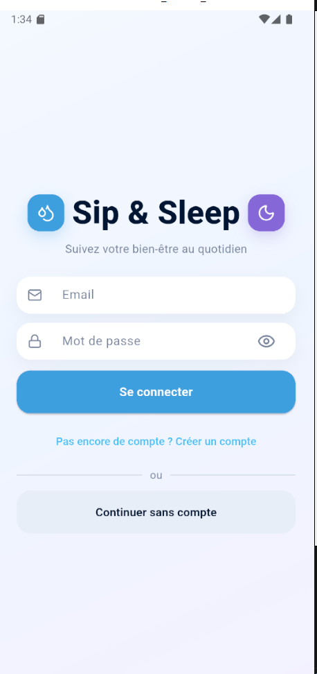
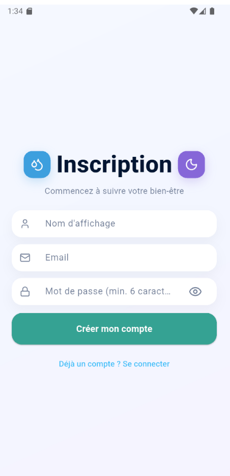
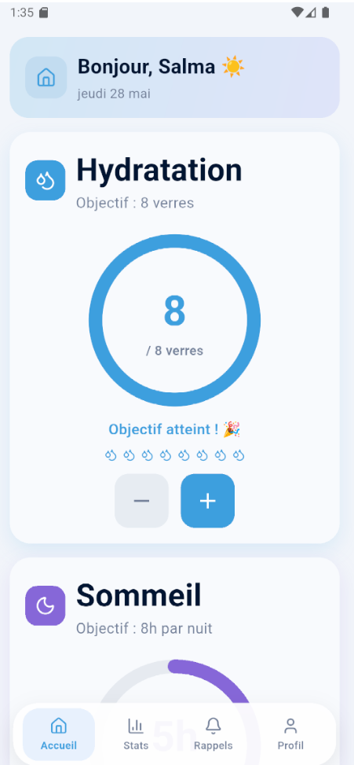
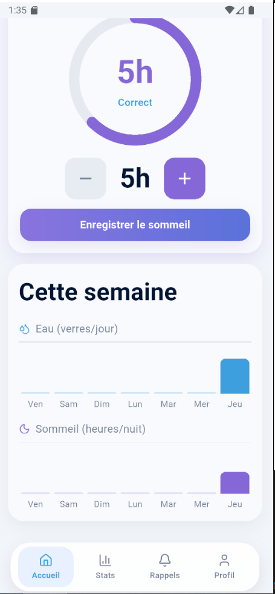
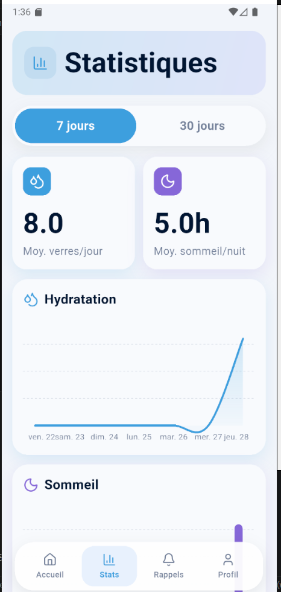
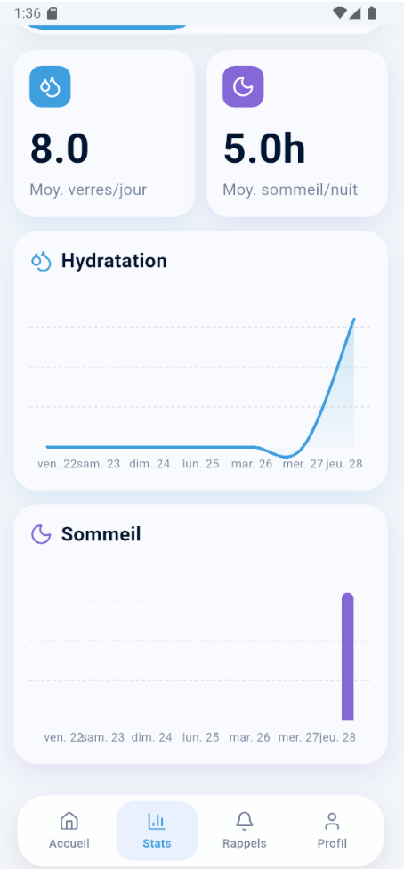
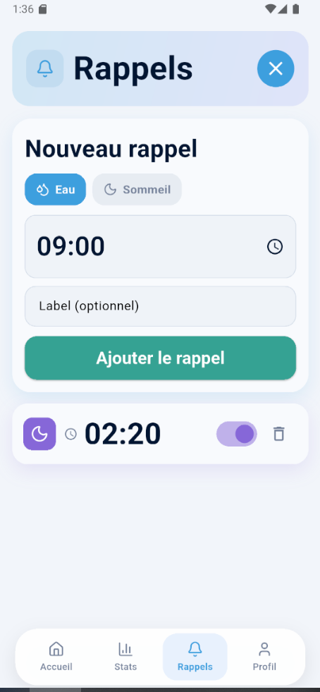
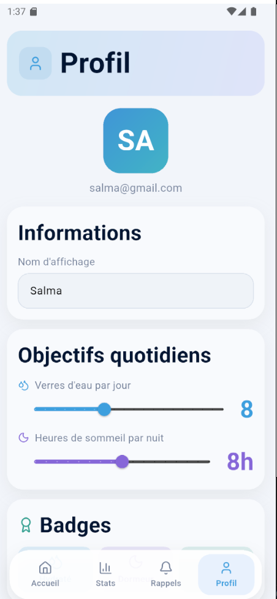
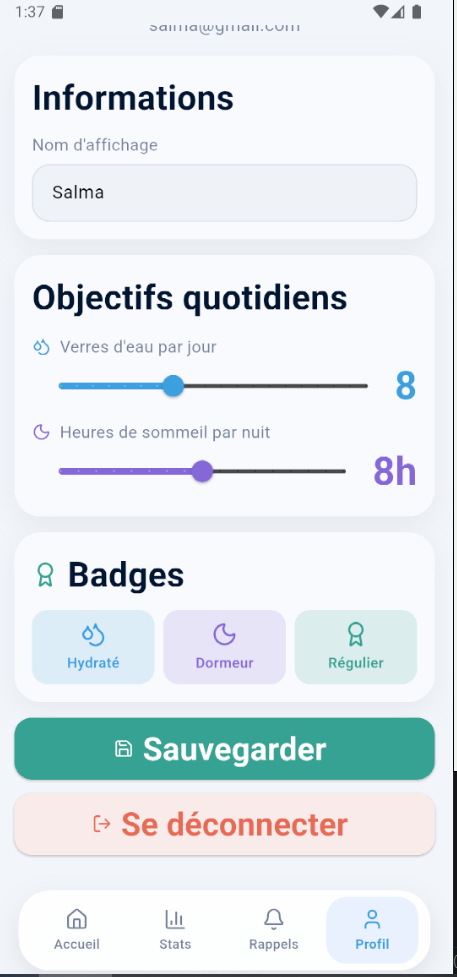

# 🌙💧 Sip & Sleep

A modern Flutter wellness application focused on hydration tracking, sleep monitoring, reminders, and personal wellness statistics.

---

## ✨ Features

### 💧 Hydration Tracking

* Track daily water intake
* Daily hydration goals
* Interactive circular progress
* Quick add/remove controls
* Goal completion feedback

### 🌙 Sleep Monitoring

* Track sleep duration
* Sleep quality visualization
* Daily sleep goals
* Sleep statistics dashboard

### 🔔 Smart Reminders

* Water reminders
* Sleep reminders
* Custom reminder scheduling
* Notification support

### 📊 Statistics Dashboard

* 7-day and 30-day statistics
* Hydration charts
* Sleep charts
* Average daily metrics
* Visual analytics

### 👤 User Profile

* Editable profile information
* Daily goal customization
* Achievement badges
* Local user preferences

---

## 📱 Screenshots

### Authentication

| Login                           | Signup                           |
| ------------------------------- | -------------------------------- |
|  |  |

---

### Home Screen

| Home 1                          | Home 2                          |
| ------------------------------- | ------------------------------- |
|  |  |

---

### Statistics

| Stats 1                          | Stats 2                          |
| -------------------------------- | -------------------------------- |
|  |  |

---

### Reminders



---

### Profile

| Profile 1                          | Profile 2                          |
| ---------------------------------- | ---------------------------------- |
|  |  |

---

## 🛠 Tech Stack

* Flutter
* Dart
* Riverpod
* Flutter Local Notifications
* Shared Preferences
* Material Design 3

---

## 🚀 Getting Started

### Prerequisites

* Flutter SDK
* Android Studio
* Android Emulator or Physical Device

---

### Installation

```bash
git clone https://github.com/YOUR_USERNAME/sip_sleep.git
cd sip_sleep
flutter pub get
flutter run
```

---

## 📂 Project Structure

```text
lib/
 ├── core/
 ├── features/
 │    ├── auth/
 │    ├── home/
 │    ├── reminders/
 │    ├── stats/
 │    └── profile/
 ├── widgets/
 └── main.dart
```

---

## 🎯 Future Improvements

* Dark mode
* Firebase authentication
* Cloud sync
* Advanced analytics
* AI wellness recommendations
* Better notification scheduling
* Streak system
* Gamification

---

## 👩‍💻 Author

Developed by Salma Ezzerrouti

---

## 📄 License

This project is for educational and portfolio purposes.
